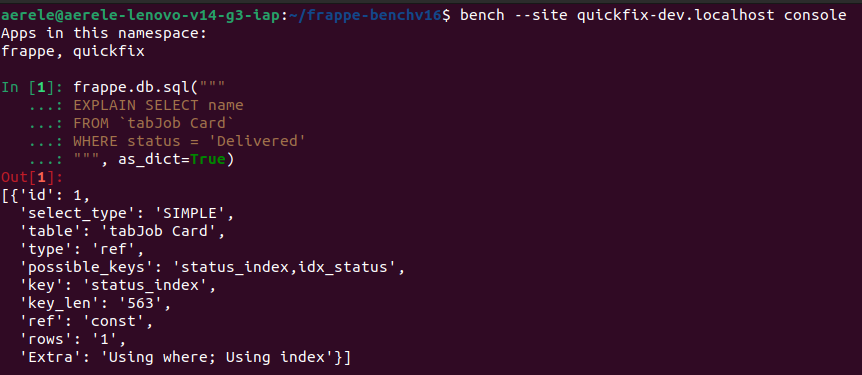
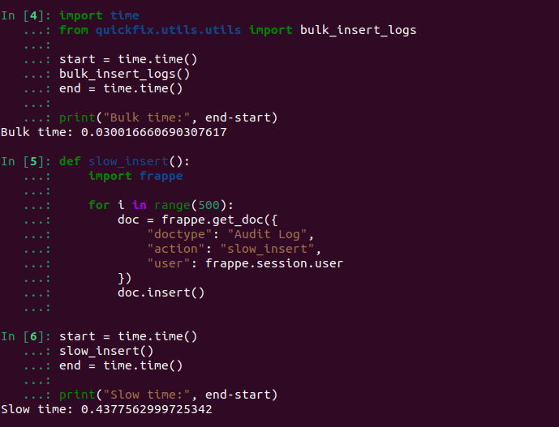
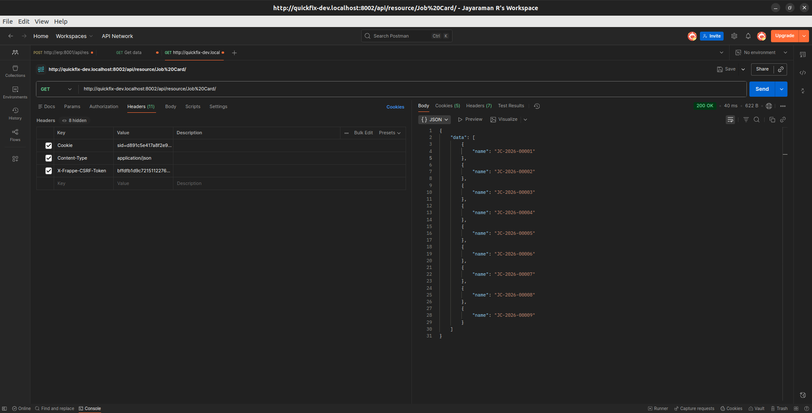
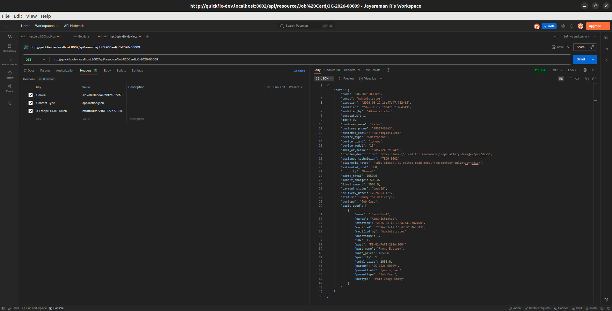
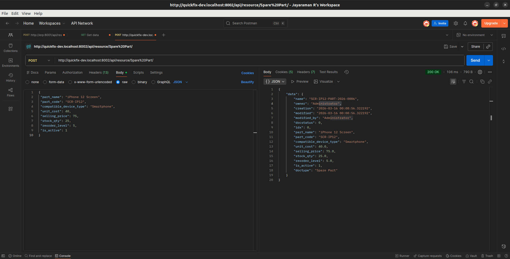
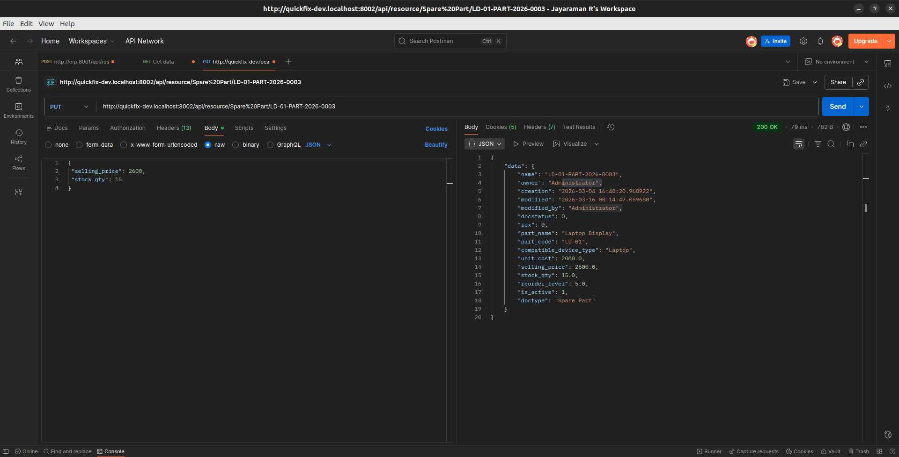
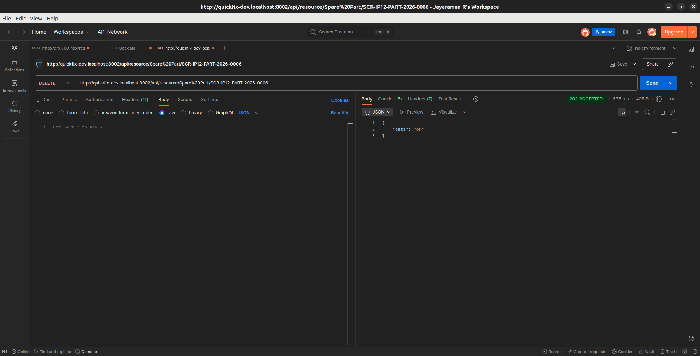

### /api/method/quickfix.api.get_job_summary

When this URL is called, Frappe treats it as a request to a Python function marked with @frappe.whitelist().

The request goes through Nginx → Gunicorn → WSGI → Frappe.
Frappe imports quickfix/api.py, runs get_job_summary(), and sends the returned data as JSON.

DocType REST API

### /api/resource/Job Card/JC-2024-0001

This uses Frappe’s built-in REST system.

Instead of custom code, Frappe directly fetches the “Job Card” document from the database.
Before sending data, it checks user permissions. If access is not allowed, it returns an error.

Website Route

### /track-job

This is not an API — it is a web page route.

Frappe looks inside the www folder of installed apps.
If track-job.py or track-job.html exists, it renders that page.
If nothing matches, a 404 error is shown.

### Security & Session
CSRF Token

X-Frappe-CSRF-Token protects POST requests from forgery attacks.
It is tied to the logged-in user session.
Missing or invalid token → request rejected (403).

### Session Data

frappe.session contains info like user ID and session ID.

In bench console, frappe.session.data may be empty because it is not a real browser session.

### Production Mode
developer_mode = 0

In production, detailed errors are hidden.
Users only see generic messages like “500: Uncaught Exception”.

Full errors are stored in log files:

- logs/web.error.log
- logs/worker.error.log

Admins can check these for debugging.

### Permission Checks

When frappe.get_doc() is called normally, Frappe verifies whether the current user can access that document.

If not allowed → PermissionError → request stops.

Permission checks happen at the ORM level, protecting database records.

### Database & ORM Basics

Each DocType becomes a table named:

tab<DocType Name>

Example:
Job Card → tabJob Card

### DocStatus Values

0 → Draft (editable)
1 → Submitted (locked)
2 → Cancelled (invalid)

Frappe also prevents overwriting changes if another user modified the document meanwhile.

### Document Validation Example

Inside validate() you can compute values:

``` self.total = sum(r.amount for r in self.items)```

Updating another document inside validate must be done carefully, since save operations are already in progress.

### Child Table Behavior

When adding a child row, Frappe auto-fills:

parent — parent document name
parenttype — parent DocType
parentfield — field name in parent

idx — row order

If a row is deleted, idx values are automatically rearranged without gaps.

### Rename & Tracking
Renaming Linked Documents

If a document is renamed using Frappe’s rename feature, all linked fields across the system update automatically.

Track Changes
Enabling Track Changes stores edit history:
changed fields
old vs new values
who changed

when
Saved in Version records and shown in timeline.

### Unique Constraints
Unique Field Property

Setting a field as Unique enforces uniqueness at the database level.
No duplicates allowed — safest method.

Manual Check in validate()

Using frappe.db.exists() checks duplicates in Python code.
It is slower and can be bypassed in some cases, but useful for conditional rules.

Roles, Permissions & Sharing

Permissions can be exported as fixtures for deployment using:

fixtures = ["Role", "Custom DocPerm"]
Sharing a Document via Code

Example: share a Job Card with another user (read access only):

```python
frappe.share.add(
    doctype="Job Card",
    name=job_card_name,
    user=user_email,
    read=1
)
```
### Advanced Permission Control
permission_query_conditions

Custom filters can restrict what records a role can see.
Example: technicians can view only job cards assigned to them.

has_permission

Used for document-level access logic.
Example: block invoice access if payment is not completed (except managers).

### Safe vs Unsafe Data Retrieval
Unsafe — frappe.get_all

Returns records without permission checks.
If exposed in APIs, it can leak sensitive data.

### Safe — frappe.get_list

Respects:

role permissions
custom filters
sharing rules

Recommended for public or whitelisted methods.

### Why merge=True Is Risky
When merge=True is used, the old document is combined into another one and then removed.

Problems this can cause:

Original record is permanently lost
All links now point to a different document
Conflicting data may overwrite existing info
Past records may become inaccurate

Because of this, merging should only be done when both records actually refer to the same real person or item.

### Execution Order — Controller & Hooks
# Execution Order

When a document is saved, methods run in this order:

- Controller method (validate() inside the DocType Python file)

- Specific DocType doc_events handler
- Global "*" doc_events handler

Controller always runs first.

# If Both Raise ValidationError

If the controller raises an error:

- Execution stops immediately
- Hook handlers will not run
- Only the first error is shown to the user


# If "*" and Specific DocType Are Both Registered

Example:

doc_events = {
    "*": {
        "validate": "quickfix.audit.log_change"
    },
    "Job Card": {
        "validate": "quickfix.job_card_hooks.validate_job_card"
    }
}

When saving a Job Card:

- Controller validate() runs
- validate_job_card (Job Card specific hook) runs
- log_change (global "*" hook) runs

both hooks execute.

### F3 Difference Between app_include_js and web_include_js

app_include_js is used for Desk interface customization for logged-in users.
web_include_js is used for public website functionality for visitors and portal users.

Desk scripts are not loaded on public pages, and website scripts are not loaded in the Desk interface.

doctype_tree_js is used for DocTypes that contain hierarchical parent-child relationships.

bench build --app quickfix  -  This command rebuilds static assets such as JavaScript and CSS files.

# Jinja Context- Print Formats vs Web Pages
Both Print Formats and Web Pages use Jinja templating, but their available contexts are different.
Print Format Context
Print formats are used to generate PDFs or printable documents.

### F4 override_whitelisted_methods Hook
override_whitelisted_methods is a hook-based approach in Frappe where you explicitly replace a whitelisted API method through hooks.py, making it visible, maintainable, and reversible.
Monkey patching directly replaces a function at import time in Python, which is invisible to the framework, harder to track, and more brittle during upgrades.
# When to Use Each
Use override_whitelisted_methods when you want to safely customize a Frappe API endpoint using the framework’s extension mechanism.

A signature mismatch occurs when the override method does not accept the same arguments as the original method.

# When a TypeError Happens 
A TypeError occurs when the overridden function is missing required parameters or cannot accept keyword arguments passed by the framework.

# F5 Fieldname collision risk:
If a Custom Field uses the same fieldname as a field added in a future Frappe update, 
it can cause database conflicts like duplicate columns or override the framework field, leading to migration errors.

# Patching order:
Patches must be separate in patches.txt so Patch 1 runs first to create the field and Patch 2 runs afterward to use it; 
merging them can break migrations if the field doesn’t exist when accessed.

# G1 Safe Monkey Patch with Version Guard
1. It prevents the monkey patch from being applied multiple times.

2. __init__.py runs on every import, while a separate file keeps patches controlled and documented.

3. it follows safer framework extension methods first and uses risky monkey patching only as a last resort.

# H1 Job Card Form Script

1.frappe.call is asynchronous, so the validation event finishes before the server response returns.
This means validation cannot reliably depend on the server result.

2.These events run after the form loads and allow asynchronous server calls safely.
They do not interfere with the save/validation lifecycle.

# H3 List View & Tree View
1.A Tree DocType in Frappe is used to represent hierarchical data where records have parent-child relationships.
2.doctype_tree_js is a client-side JavaScript file used to customize the behavior of a Tree DocType in Frappe.

# H4 Client Script DocType vs Shipped JS
Client Script DocType is used by consultants for quick UI customizations directly from the system without deployment. Shipped JS is used by app developers for stable, version-controlled logic inside the application code.

Hiding a field in JavaScript only affects the user interface, not the backend data, so the field’s value can still be accessed through API calls, database queries, or developer tools, meaning it does not provide real security.

# I1 Query Report with SQL Safety
Issue (f-string SQL):
Using f-strings in SQL directly inserts user input into the query, which can lead to SQL injection vulnerabilities.

Solution (Parameterized pattern):
Using parameterized queries like %(device_type)s separates user input from SQL code, preventing SQL injection and making the query secure.


Index usage:
key: status_index, which confirms that the database is using the index on the status column.
This improves performance because the query retrieves rows using the index instead of scanning the entire table.

# I4 Prepared Report
1.Prepared Reports run in the background using a worker process and store the generated results for later use. They are useful for reports with large datasets or complex queries.

Real-time Script Reports run immediately when opened and show the latest data. They may load slowly if the dataset is large.

2.Caching risk occurs when underlying data changes after a report is prepared, causing users to see outdated information until the report is regenerated.

# I5 Report Builder & Custom Report
1. Report Builder is appropriate for simple reports that list fields from a single DocType with basic filters and no custom logic.

2.you must use a Script Report when the report requires complex queries, joins, calculations, or custom business logic,
using Report Builder for a large multi-table analytical report in production would be a mistake because it would be inefficient and inaccurat

# J1 
Calling frappe.get_all() directly inside a Jinja template is not recommended because it mixes database logic with the presentation layer and can slow down rendering.

Instead, pre-compute the data in before_print(), attach it to self (e.g., self.precomputed_field), and then reference it in the template as doc.precomputed_field to keep logic and presentation clean.

# J2 Raw Print vs HTML to PDF
Raw printing (ESC/POS) sends direct printer commands to a thermal printer to control text and formatting, while WeasyPrint HTML-PDF rendering converts HTML and CSS into a PDF before printing.

Examples of CSS that work in browsers but often fail in WeasyPrint include display: flex, display: grid, and position: fixed.

Without format_value(), a Currency field prints the raw number without currency formatting.

# K1 - Background Jobs: Queues, Timeouts, Progress

default – Normal background tasks of medium duration; used when the job is not extremely quick or very heavy.

short – Very fast tasks (emails, notifications) so they don’t wait behind heavy jobs.

long – Heavy or long-running jobs (reports, bulk processing, imports) that may take several minutes.


By default, Frappe does not retry failed background jobs (0 retries).
If a job fails, it is immediately moved to the RQ Failed Jobs registry and logged in Error Log unless retries are explicitly configured.

# K3 Fix the N+1 Query Problem

job_cards = frappe.get_all(
    "Job Card",
    fields=[
        "name",
        "assigned_technician",
        "assigned_technician.technician_name",
        "assigned_technician.phone"
    ]
)

for jc in job_cards:
    print(jc.technician_name, jc.phone)

# Task B - Bulk operations:

bulk insert is much faster


# Task C – Indexing

3.Why not index every field?
Too many indexes slow down INSERT, UPDATE, and DELETE operations because every index must be updated.
Over-indexing also increases storage and memory usage, reducing overall database performance.

# L1 - REST Resource API & Custom API

1.GET Method - list Job Cards


2.GET Method - single doc


3.POST - Create a part


4.PUT - Update a field


5.DELETE - Delete it


GET /api/resource/Job Card returns a list of Job Cards, and GET /api/resource/Job Card/JC-0001 returns a single Job Card document.
POST /api/resource/Spare Part creates a part, PUT /api/resource/Spare Part/PART-0001 updates it, and DELETE /api/resource/Spare Part/PART-0001 removes the record.


Session cookie authentication uses a browser login session (sid) and is mainly used for web browser access.
Token authentication uses API key and secret in headers and is used for server-to-server or external application integrations.


# Task D - Rate limiting & abuse protection:

1.Unauthorized Data Access: With allow_guest=True, attackers can access endpoints without authentication and may retrieve sensitive information if proper permission checks are missing.

2.Abuse & Spam Requests: Attackers can repeatedly call the endpoint to perform actions (e.g., form submissions or resource creation), leading to spam, database pollution, or service abuse.

3.Enumeration & Information Leakage: Public endpoints can be probed to discover valid IDs, users, or system structure, helping attackers map the application for further attacks.